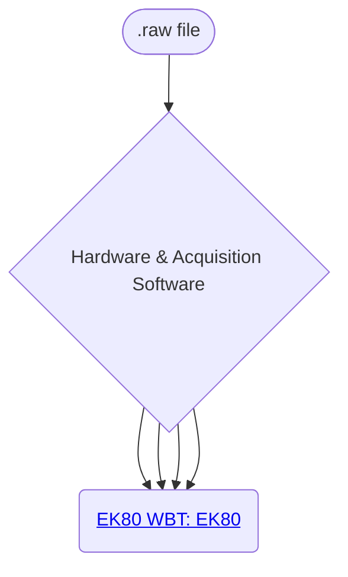

# Kongsberg/Simrad Data Path
NOAA has used a number of Kongsberg/Simrad echosounders over the decades. 

    [idHAS-->idEK60ER60@{ shape: rounded, label: "EK60 GPT : ER60" };]:#
    [idHAS-->idEK60EK80@{ shape: rounded, label: "EK60 GPT : EK80" };]:#
    [idHAS-->idEK80EK80@{ shape: rounded, label: "EK80 WBT : EK80" };]:#

