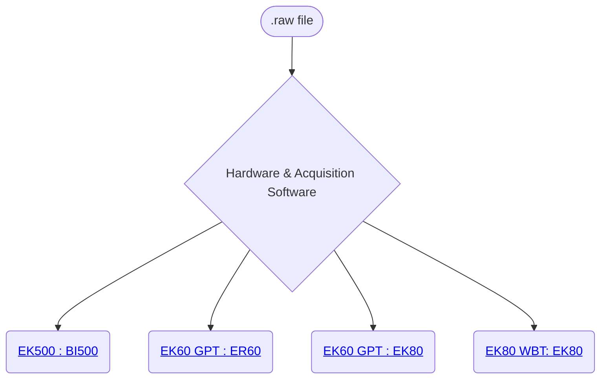

# Kongsberg/Simrad Data Path
NOAA has used a number of Kongsberg/Simrad echosounders over the decades. 

```mermaid
flowchart TD;
    idRF@{ shape: stadium, label: ".raw file" }-->idHAS@{ shape: diamond, label: "Hardware & Acquisition Software" };

    idHAS-->idEK500@{ shape: rounded, label: "<a href='https://github.com/jmjech/schematic_test/blob/main/Kongsberg-Simrad/EK500-BI500/README.md'>EK500 : BI500</a>" };

    idHAS-->idEK60ER60@{ shape: rounded, label: "<a href='https://github.com/jmjech/schematic_test/blob/main/Kongsberg-Simrad/EK60GPT-ER60/README.md'>EK60 GPT : ER60</a>" };

    idHAS-->idEK60EK80@{ shape: rounded, label: "<a href='https://github.com/jmjech/schematic_test/blob/main/Kongsberg-Simrad/EK60GPT-EK80/README.md'>EK60 GPT : EK80</a>" };

    idHAS-->idEK80EK80@{ shape: rounded, label: "<a href='https://github.com/jmjech/schematic_test/blob/main/Kongsberg-Simrad/EK80-EK80/README.md'>EK80 WBT: EK80</a>" };
```
