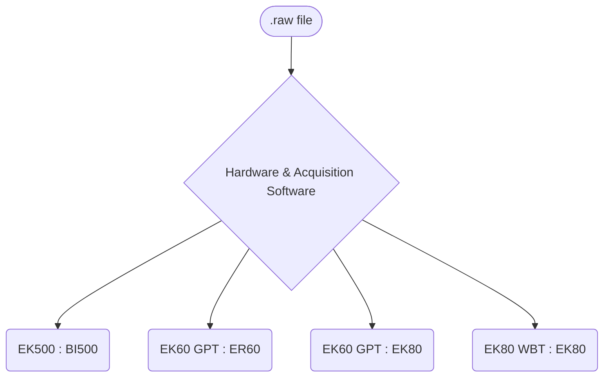

# Kongsberg/Simrad Data Path
NOAA has used a number of Kongsberg/Simrad echosounders over the decades. 

["<a href='https://github.com/jmjech/schematic_test/blob/main/Kongsberg-Simrad/README.md'>Kongsberg-Simrad</a>"]:#
