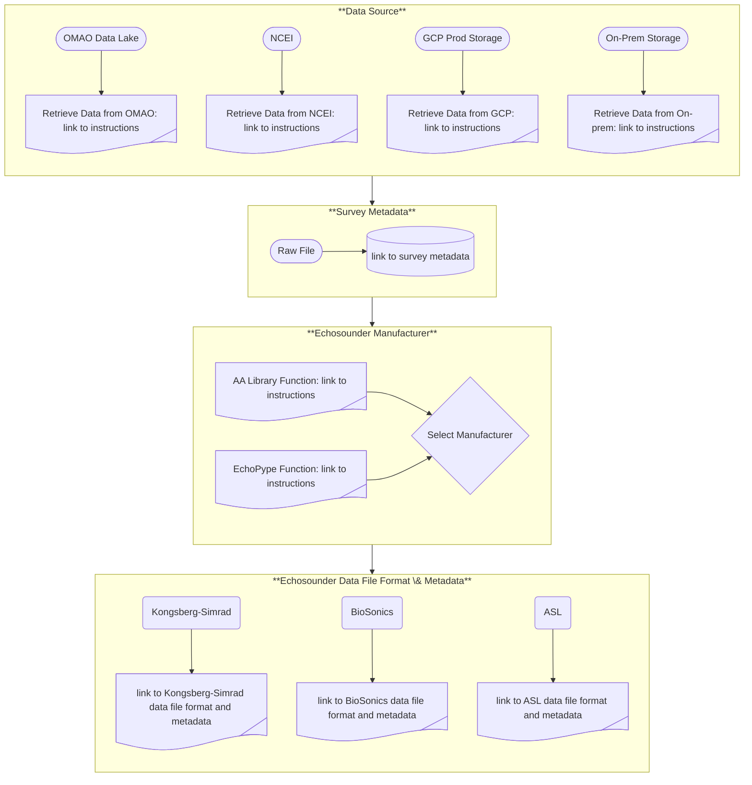

# Level 0 Data
test generating schematics in github

```mermaid
flowchart TB
    subgraph Source["**Data Source**"]
        direction TB
        idSrcOMAO@{shape: stadium, label: "OMAO Data Lake"} --> idOMAO@{ shape: tag-doc, label: "Retrieve Data from OMAO: link to instructions" }
        idSrcNCEI@{shape: stadium, label: "NCEI"} --> idNCEI@{ shape: tag-doc, label: "Retrieve Data from NCEI: link to instructions" }
        idSrcGCP@{shape: stadium, label: "GCP Prod Storage"} --> idGCP@{ shape: tag-doc, label: "Retrieve Data from GCP: link to instructions" }
        idSrcOP@{shape: stadium, label: "On-Prem Storage"} --> idOP@{ shape: tag-doc, label: "Retrieve Data from On-prem: link to instructions" }
    end
    subgraph SurveyMetaData["**Survey Metadata**"]
        direction LR
        idRF@{ shape: stadium, label: "Raw File" } --> idSMD@{ shape: database, label: "link to survey metadata" }
    end
    subgraph ESManufacturer["**Echosounder Manufacturer**"]
        direction LR
        idAL1@{shape: tag-doc, label: "AA Library Function: link to instructions"} --> idMan@{ shape: diamond, label: "Select Manufacturer" }
        idAL2@{shape: tag-doc, label: "EchoPype Function: link to instructions"} --> idMan
    end
    subgraph ESMetaData["**Echosounder Data File Format \& Metadata**"]
        direction TB
        idKS@{ shape: rounded, label: "Kongsberg-Simrad" } --> idKSMD@{ shape: tag-doc, label: "link to Kongsberg-Simrad data file format and metadata" }
        idBS@{ shape: rounded, label: "BioSonics" } --> idBSMD@{ shape: tag-doc, label: "link to BioSonics data file format and metadata" }
        idASL@{ shape: rounded, label: "ASL" } --> idASLMD@{ shape: tag-doc, label: "link to ASL data file format and metadata" }
    end
    Source --> SurveyMetaData
    SurveyMetaData --> ESManufacturer
    ESManufacturer --> ESMetaData
```
