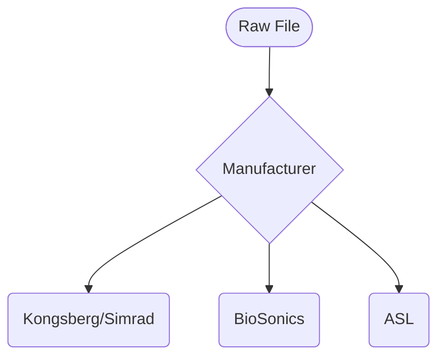

# schematic_test
test generating schematics in github

```mermaid
flowchart TD;
    idRF@{ shape: stadium, label: "Raw File" }-->idMan@{ shape: diamond, label: "Manufacturer" };
    idMan-->idKS@{ shape: rounded, label: "Kongsberg/Simrad" };
    idMan-->idBS@{ shape: rounded, label: "BioSonics" };
    idMan-->idASL@{ shape: rounded, label: "ASL" };
```
